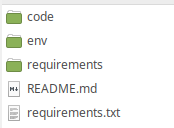
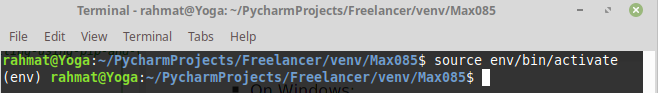
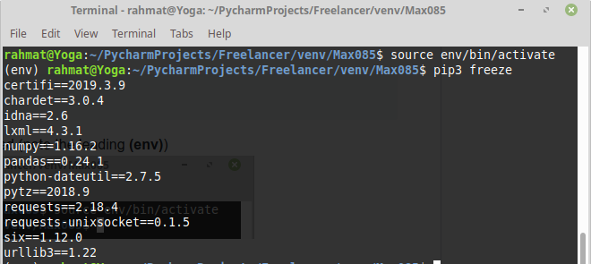
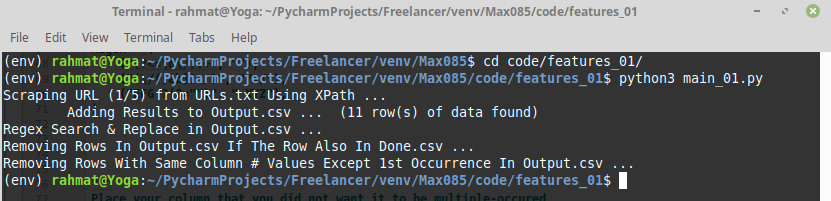
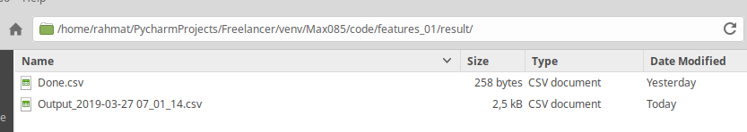
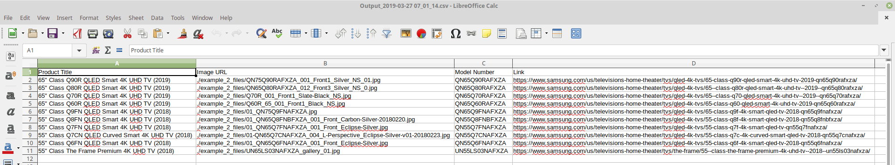

# max085
Python flexible web scrapper


**this documentation is still work in progress**


## Before Starting
- Make sure to have Python 3.x (Development is in v3.6.7)
- Go to project directory by opening your console (cmd/powershell) and type
  ```
  cd /path/to/your/code/max085
  ```
  
  You can also SHIFT + LEFT CLICK from exploler pointed at your directory, and choose "Open Powershell here".


## Important Notes
What I know is that we differ in system. You use windows and I use Linux.
The logical will still the same, but you might encounter different syntax.

Example: 
- I used `python3 python_file.py` to run python file. You might be need to use `python python_file.py` instead
- I used `pip3 install module_name` to install a module. You might be need to use `pip install module_name` instead


## Setting virtual environtment
[What is Virtual Env?](https://packaging.python.org/guides/installing-using-pip-and-virtualenv/) or  [Why should I use virtual env?](https://stackoverflow.com/questions/41972261/what-is-a-virtualenv-and-why-should-i-use-one)

This is optional. But I strongly recommend that you use virtual env so you did not messed up your global dependency, knowing that you also code in python already.

- Installing virtualenv (if you did not have one) 
  ```
  py -m pip install --user virtualenv
  ```
- Creating virtualenv    

  ```
  py -m virtualenv env
  ```
  You will note that a new folder called "env" will be present on you directory
  
  

- activate your virtualenv
  ```
  .\env\Scripts\activate
  ```

  if your cmd/powershell change like this, then it succeed (note the leading **(env)**)
  
  
  
  Note:
    - as long as there are leading **(env)** in your cmd, you are in virtual environtment scope
    - to exit from that, type `deactivate`
  
- install dependency

  Assuming that you are inside virtual env, run:
  ```
  pip3 install -r requirements.txt
  ```
- Check if dependency is installed by running

  ```
    pip3 freeze
  ```
  
  A list of installed dependency will shown as below.
  
  
  
  Note:
   I code with Linux Mint, so your list of dependency might a bit different because our system differ. 
   It is completely fine. Just make sure that these major module are printed at your console:
     - lxml
     - pandas
     - python-dateutil
     - requests
     
     
You are ready to go.  

## Feature 1

### Configuring

- Open [code/features_01/config.py](code/features_01/config_01.py)
- Change according to your need
  - `Xpath`: describe the attribute you want to obtain from HTML, and its XPath. 
    Because we agreed to divide each element with each XPath, there will not be OR or AND on the deepest (right-most) 
    elements. But occurrence in the middle element is possible.
    
    Example:
      - `"Source Image": "/div/img/@src"` 
        
        valid. we seek `` inside `<div>`
      - `"Source Image" : "/div[@class and @id]/img/@src"` 
      
        valid. because we seek `` inside `<div>` that have `class` AND `id`
      - `"Source Image: "/div/img/[@src | @class]"` 
      
        **invalid**. the code can't decide if the "Source Image" comes from `src` or `class`. You should reformat it to 
        two XPath that likely will like this:
        - `"Source Image: "/div/img/@src"` 
        - `"Source Image's Class: "/div/img/@class"`

    Don't forget the trailing comma after each XPath declared.
  
  - `Regex`: place your regex here and what the replace string will be
  
    If you want to disable this features, simply declare Xpath as empty tuple `Columns = ()`

  - `Columns`: place one or multiple Column's name that you want to be considered so that no multi occurrence appears
    
    Example:
      - `'Link'`: means the Link attribute should always be unique
      - `'Link', 'Model Name'`: means the Link and Model Name attribute should always be unique
    
    If you want to disable this features, simply declare Columns as empty tuple `Columns = ()`

  - Test Mode and Debug Mode
    - `TestMode`: to test if you can run the code. If `True`, the code will not request an HTML via internet. 
      This will only scrap [code/features_01/example_2.html](code/features_01/example_2.html) 
      (the one you gave in Xpath.txt, leading to samsung.com).
      
      Turn this to `False` for production/actual internet scrapping.
    - `DebugMode`: to tell the verbosity. Good to find if attribute is correctly regexed or not, or if 
      multiple occurrence is evalueted correclty or not. 
      
      Turn this to `True` to enable verbose mode, but the CLI will get a bit dirty. Turn this to `False` to minimize 
      the verbosity.

### Running

- Assuming that you already inside virtualenv, go to `Feature 01` directory and run [main_01.py](code/features_01/main_01.py)
  ```
  cd code/features_01/
  python3 main_01.py
  ```
  
  The output will be like this:
  
  
  
  The Output.csv will also be generated:

  
  
  And if we open Output.csv, it will look like this :
  
  
  
  
  Note that Output.csv only contains 10 elements. This is because I picked 1 element and put it into Done.csv.
  The code will know that duplucate link exist, and it will not be logged into Output.csv
  
## Feature 2

- the coding template is finished
- I will start coding for feature 2 while you test the feature 1

